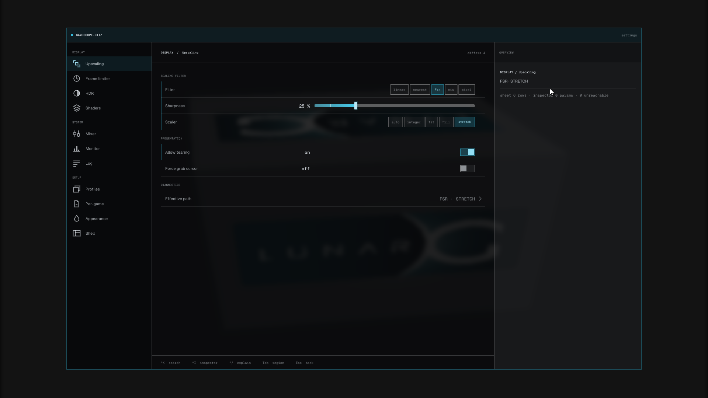
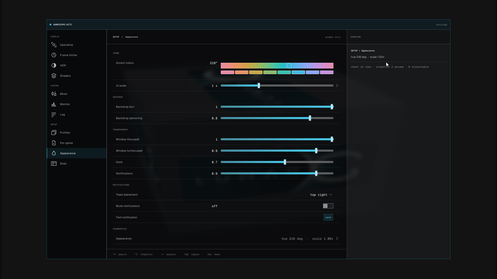

<div align="center">

# gamescope-ritz

**An in-game settings overlay for Valve's [gamescope](https://github.com/ValveSoftware/gamescope) compositor.**

Change scaling, HDR, shader effects, or a game's nested resolution and refresh rate
without alt-tabbing out or restarting anything, save it as a per-game profile that
inherits from a general one, and glance at an FPS number or a crosshair drawn by the
compositor itself.

📖 **[Full documentation »](superdoc/README.md)** — start at
[`superdoc/architecture/overview.md`](superdoc/architecture/overview.md) to navigate the code.

*(No logo yet — the screenshots below are this section's visual, until there's real artwork.)*

<p align="center">
   Upscaling, showing the sidebar, the scaling filter/sharpness/scaler controls, and the live inspector rail on the right">
</p>

</div>

## Fork of gamescope

**gamescope-ritz** is a fork of Valve's [gamescope](https://github.com/ValveSoftware/gamescope).
Its base commit is exactly upstream `ValveSoftware/gamescope` HEAD
([`fcc1341`](https://github.com/ValveSoftware/gamescope/commit/fcc1341)) — everything below
that commit is unchanged upstream code; everything above it is this fork's own, additive
work: the settings overlay, the FPS HUD, the crosshair, profiles, and the rest covered
below. Upstream's own README content (the compositor's own description, its usage
examples, its full option reference, and its Reshade/keyboard-shortcut docs) is preserved
verbatim in [`README.upstream.md`](README.upstream.md) rather than deleted.

It installs as its own binary, `gamescope-ritz`, side by side with a distro-packaged
`gamescope` — it never touches `/usr/bin/gamescope`.

## Quick start

```sh
# 1. Get the code
git clone https://github.com/Ritze03/gamescope-ritz.git
cd gamescope-ritz

# 2. Install it (Linux only) — builds a release binary first if none exists
#    yet (a few minutes the first time), then asks whether to symlink or
#    copy the result to /usr/bin/gamescope-ritz
./install.sh --install

# 3. Run a game through it
gamescope-ritz -- %command%          # inside Steam's launch options
gamescope-ritz -- vkcube             # or any game/binary, tried by hand

# 4. Open the settings overlay in-game: tap Right Shift (it toggles closed
#    the same way). Left Ctrl + Right Shift opens the Launcher instead — the
#    same searchable settings, alone over the game, no shell behind it.
```

Non-interactively (no prompts, symlink mode — a later `./install.sh --update`
then needs no root at all, since it just rebuilds and the installed name is
already pointing at the fresh binary):

```sh
./install.sh --install --link --yes
```

Running `./install.sh` with no flags detects whatever state you're in
(installed or not, symlink or copy, wlroots satisfied or not) and offers
install/update/remove as a menu instead.

### Updating

```sh
./install.sh --update
```

`git pull --ff-only`, rebuild, reinstall in place — a symlink install is live
the instant the rebuild finishes; a copy install gets the fresh binary copied
over it. It refuses on a dirty tree or a diverged remote rather than stashing
or resetting anything for you.

### Picking a profile per launch

A [profile](superdoc/features/profiles.md) is the settings file being edited — general
(`Casual`, `Comp`) or bound to one game. `--profile` (or its environment-variable
equivalent) picks one for a single session without touching which profile the game
normally loads, which is how a launcher like [Ritz](superdoc/features/ritz-extension.md)
drives it:

```sh
gamescope-ritz --profile Competitive -- %command%
GS_RITZ_PROFILE=Competitive gamescope-ritz -- %command%   # same effect; the flag wins if both are set
```

### Dependencies

Before building anything, `./install.sh` checks that **wlroots** is actually usable the
way this project's meson build asks for it — pkg-config for the exact module and
version, not just "some package manager says it's installed" — and prints the fix if
not. On Arch/CachyOS that's `sudo pacman -S wlroots0.20`; other distros get the
pkg-config module name and version needed. If a system wlroots isn't found but this
repo's vendored copy (`subprojects/wlroots`) is checked out, that's not a failure —
meson just builds it instead (slower first build).

For the rest of the build toolchain, this repo tracks a verified **Debian/Ubuntu**
package list: `sudo apt install meson ninja-build pkg-config cmake libpipewire-0.3-dev
hwdata libx11-dev libwayland-dev libvulkan-dev wayland-protocols libx11-xcb-dev
libxdamage-dev libxcomposite-dev libxcursor-dev libxxf86vm-dev libxtst-dev libxres-dev
libxmu-dev libxkbcommon-dev libcap-dev libsdl2-dev libavif-dev libpixman-1-dev
liblcms2-dev libseat-dev libinput-dev xwayland libxcb-composite0-dev libxcb-ewmh-dev
libxcb-icccm4-dev libxcb-res0-dev glslang-tools libluajit-5.1-dev libcatch2-dev` (on
other distros, install the equivalents through your own package manager — see
[`README.upstream.md`](README.upstream.md#building) for upstream's own build
instructions, which this still follows underneath `install.sh`). You do **not** need to
run `git submodule update` yourself — `install.sh` detects missing submodules and
initialises them automatically.

## What this fork adds

<p align="center">
   Appearance, showing the accent-colour picker and the backdrop/transparency sliders">
</p>

| Feature | | Docs |
|---|---|---|
| **Shell & Launcher** | A full in-game settings overlay (the **Shell**) and a standalone, searchable command palette (the **Launcher**) that opens alone over the game with no shell behind it. | [`planning/redesign/round-2/e2-inspector-plus/`](superdoc/planning/redesign/round-2/e2-inspector-plus/) |
| **FPS HUD** | A single on-screen FPS number: a 9-point anchor, pixel margins, a chosen font size, text-colour modes, an outline, and a lag-spike colour reaction. | [`features/fps-display.md`](superdoc/features/fps-display.md) |
| **Crosshair** | A compositor-drawn crosshair that composites *after* an external frame-generation layer such as `lsfg-vk`, so unlike an in-game crosshair it never smears. | [`features/crosshair.md`](superdoc/features/crosshair.md) |
| **Profiles** | General and per-game settings profiles with live, diff-based inheritance — every edit saves immediately, no load/save step. | [`features/profiles.md`](superdoc/features/profiles.md) |
| **Editable keybinds** | Rebind the Shell/Launcher chords from inside the Shell itself, with one chord that can never be taken away. | [`features/keybinds.md`](superdoc/features/keybinds.md) |
| **Native shader effects** | Saturation, Vibrancy, Shadow Control, Pre-Sharpen, Adaptive Brightness, Adaptive Gamma and Bloom, compiled into the binary as one compute pre-pass. | [`features/shader-effects.md`](superdoc/features/shader-effects.md) |
| **Clipboard sync** | One `CLIPBOARD` value kept in step across every Xwayland game, gamescope's own Wayland clients, and the host session when nested. | [`features/clipboard-sync.md`](superdoc/features/clipboard-sync.md) |
| **Runtime nested resolution & refresh** | Change a game's own resolution and paced refresh rate live from the Shell — nothing restarts, not even Xwayland. | [`features/resolution-and-refresh.md`](superdoc/features/resolution-and-refresh.md) |
| **Steam friends list** | `Ctrl+Shift+Tab` lists friends who are in a game right now, read straight from the Steam client already running — join one marked `[Join]` with a click. | [`features/steam-friends.md`](superdoc/features/steam-friends.md) |
| **Ritz launcher extension** | A module for the user's own [Ritz](https://ritze03.github.io/ritz/extensions.html) launcher that drives `gamescope-ritz` — profile, resolution, scaler and more — from Ritz's own GUI. | [`features/ritz-extension.md`](superdoc/features/ritz-extension.md) |

## Keyboard shortcuts

These are this fork's own defaults; all but the last are rebindable from the Shell's
Setup > Keybinds area (`gamescopectl ritz_keybinds_reset` puts them back if a rebind
goes wrong):

| Chord | Action |
|---|---|
| `Right Shift` (tap) | Open/close the settings Shell |
| `Ctrl+Shift+O` | Open/close the Shell (alternate — for when Right Shift alone is inconvenient) |
| `Left Ctrl` + `Right Shift` | Open/close the Launcher (the command palette, alone over the game) |
| `Ctrl+Shift+Tab` | Open/close the Steam friends list (join a friend marked `[Join]`) |
| `Ctrl+Alt+Shift+O` | Always opens the Shell — reserved, cannot be rebound or taken by another action |

Upstream gamescope also has its own `Super`-prefixed shortcuts (fullscreen, filtering,
FSR/NIS toggles, screenshot); those need something like Steam registered as a
`gamescope_control` client to fire, and are unchanged by this fork — see
[`README.upstream.md`](README.upstream.md#keyboard-shortcuts).

## Command-line additions

Every upstream option still works (see [`README.upstream.md`](README.upstream.md#options)); on top of `--profile` above, this fork adds:

- **`--force-windows-fullscreen`** — force every window inside gamescope's own embedded
  Xwayland session open at the full nested-canvas size, regardless of its own requested
  size; also a "Force maximize nested window" switch in the Shell (Display > General).
- **`--ritz-dump-config`** — print which app id and profile the session resolved to (and
  why), its parent, its launch option, and the settings it would run with, without
  starting a game.

## Removing it

```sh
./install.sh --remove
```

Never touches `~/.config/gamescope-ritz` — only the binary/symlink it installed. If
an older install left a `/usr/share/gamescope-ritz` directory behind, it offers to
clear that too; nothing needs one any more, since the bundled display scripts and the
licence texts are compiled into the binary.
